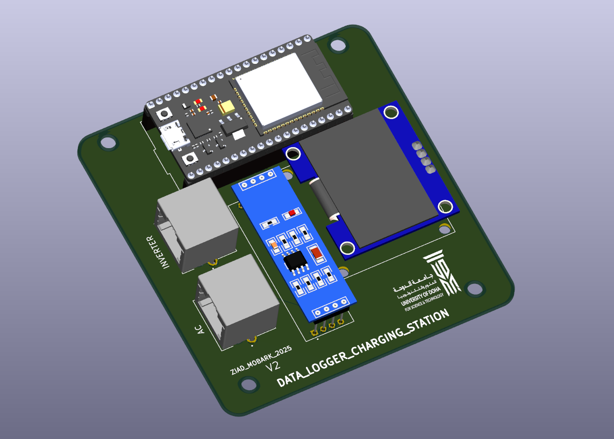
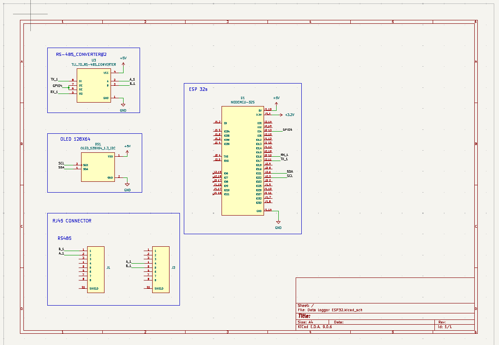
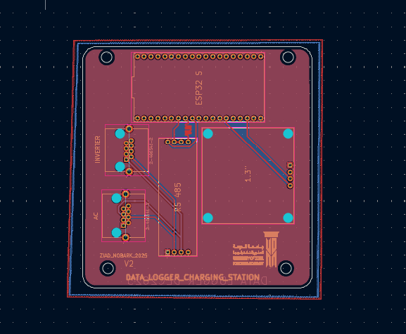
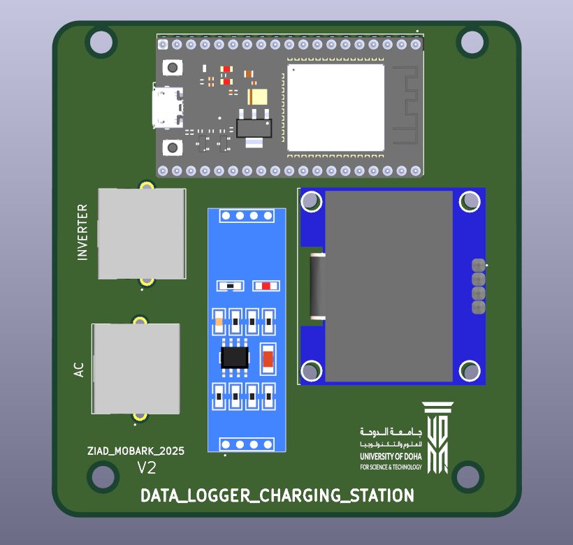
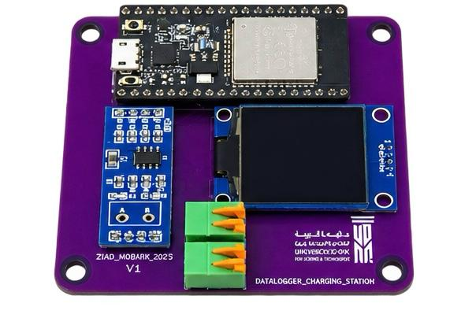
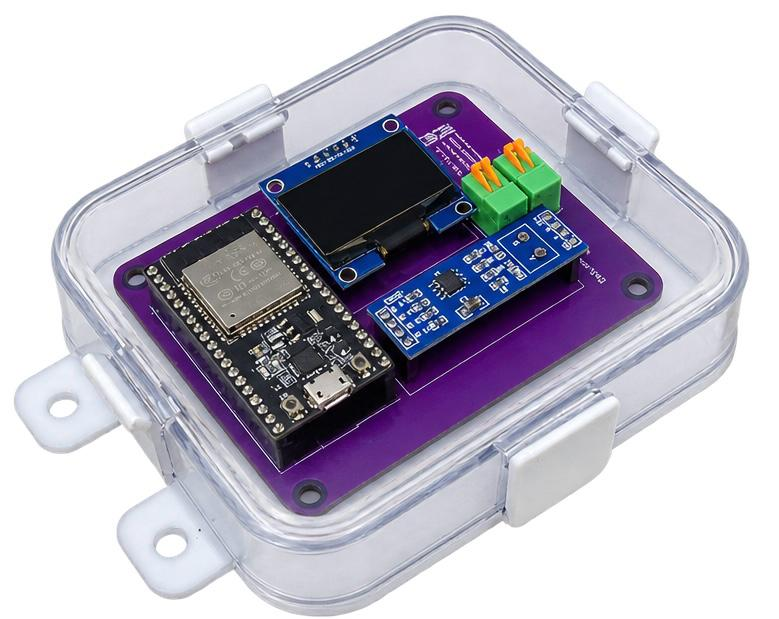
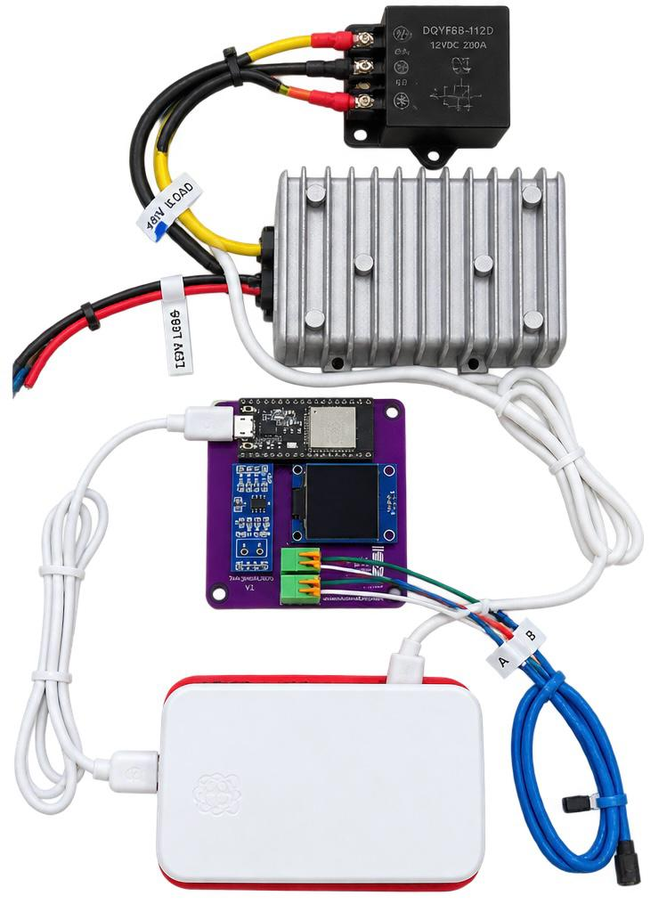

# Solar Dhow Charging Station Data Logger

## Overview

This repository documents the hardware design of a custom ESP32-based RS-485 data logger developed for the Solar Dhow charging station. The board was designed to provide a compact hardware interface between the charging-station equipment and the project data-logging system.

The PCB integrates an ESP32 development module, RS-485 communication hardware, RJ45 connections, and a 128×64 OLED display interface in a single custom board suitable for installation in the charging-station system.

## Purpose

The data logger hardware provides the physical communication interface required to collect operational information from charging-station equipment. In the complete system, the board is used with RS-485 / Modbus communication to interface with devices such as the inverter and air-conditioning unit while providing local status indication through the OLED display.

## Hardware Architecture

The custom PCB includes:

- ESP32 development-module integration
- RS-485 communication interface
- RJ45 connectors for external equipment connections
- 128×64 OLED display interface
- Power and signal routing for the integrated peripherals
- Custom PCB layout and routing designed in KiCad

## RS-485 Communication Interface

The hardware provides an RS-485 physical-layer interface for communication with charging-station equipment. In the project system, the ESP32 communicates with connected devices using Modbus RTU over RS-485.

The communication architecture supports acquisition of charging-station operating parameters while the data-logging software processes and forwards the collected information separately.

## Electrical Schematic

The electrical schematic integrates the ESP32, RS-485 interface, OLED display connection, RJ45 connectors, power rails, and associated signal routing.

## PCB Layout

The PCB was routed as a custom board to organize the controller, communication interface, display connection, and external connectors in a compact layout suitable for the charging-station installation.

## 3D PCB Design

The following renders show the final PCB design before fabrication.

### Isometric View

### Top View

## Manufactured Prototype

The PCB design was fabricated and assembled for integration and testing within the Solar Dhow charging-station system.

## Enclosure Integration

The assembled PCB was installed inside a transparent protective enclosure for use in the charging-station setup.

## Charging Station Integration

The completed data logger was integrated into the Solar Dhow charging-station system alongside the associated power and communication equipment.

## My Contribution

**Hardware Design: Ziad Mobark**

The custom ESP32-based charging-station data logger PCB was designed by Ziad Mobark, including the electrical schematic, RS-485 interface, PCB layout, routing, connector integration, and physical board design.

## Firmware / Software Attribution

**Firmware / Software Development: Project team member**

The ESP32 firmware and data-logging software were developed separately by another project team member and are not included in this repository. This repository specifically documents the hardware design contribution.

## Project Context

This data logger forms part of the wider Solar Dhow project and was developed to support charging-station monitoring and data acquisition. The board provides the hardware interface required to connect the charging-station equipment to the digital data-logging system.
